# shinyDADA2

**Interactive R/Shiny applications for 16S rRNA and ITS amplicon sequence analysis**

[](LICENSE)
[](https://www.r-project.org/)
[](https://shiny.posit.co/)

shinyDADA2 provides complete, code-free graphical interfaces for amplicon sequence analysis using the [DADA2](https://benjjneb.github.io/dada2/) pipeline. Two separate applications cover the most widely used marker genes in microbial ecology:

- **16S rRNA app** (`dada2-16s-gui.R`) — for bacterial and archaeal community profiling (10-step workflow)
- **ITS app** (`dada2-ITS-gui.R`) — for fungal community profiling (11-step workflow)

Both applications take raw paired-end Illumina FASTQ files as input and produce publication-ready figures, statistical test results, and downloadable data tables — all without writing a single line of code.

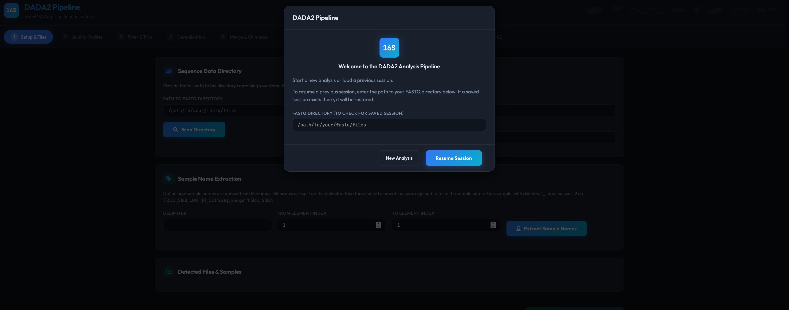

---

### Installation

### Prerequisites

- **R** (version 4.0 or higher) — [Download R](https://cran.r-project.org/)
- **RStudio** (recommended) — [Download RStudio](https://posit.co/download/rstudio-desktop/)
- **cutadapt** (ITS app only) — installed automatically via pip, or [install manually](https://cutadapt.readthedocs.io/en/stable/installation.html)

### Quick Start

1. Clone the repository:

```bash
git clone https://github.com/[username]/shinyDADA2.git
cd shinyDADA2
```

2. Launch the 16S app:

```r
shiny::runApp("dada2-16s-gui.R")
```

Or launch the ITS app:

```r
shiny::runApp("dada2-ITS-gui.R")
```

3. On first launch, all required R packages will be installed automatically. This may take several minutes.

### Required Packages

The apps automatically install missing packages on startup. The full dependency list:

**CRAN:**
shiny, ggplot2, tidyverse, shinyjs, DT, shinycssloaders, callr, vegan

**Bioconductor:**
dada2, phyloseq, Biostrings, DECIPHER, microbiome, ANCOMBC

**ITS app additionally requires:**
ShortRead (Bioconductor), cutadapt (Python)

---

## Usage

### Input Data

- **Paired-end FASTQ files** (`.fastq`, `.fastq.gz`, `.fq`, `.fq.gz`)
- Files must be demultiplexed (one pair per sample)
- Forward and reverse reads should follow a naming convention (e.g., `_R1_001.fastq.gz` / `_R2_001.fastq.gz`)

### Metadata File

- **CSV or TSV format**
- First column must contain sample names matching the extracted sample names
- Additional columns are metadata variables (e.g., Treatment, Site, Age)
- Variables are auto-detected as factor or continuous, with manual override
- Handles quoted-row CSVs (common Excel export format) automatically

### Taxonomy Databases

- **16S app:** SILVA v138.1 is downloaded automatically on first use (~130 MB)
- **ITS app:** Provide the path to a [UNITE](https://unite.ut.ee/) reference FASTA file, or point to a directory for auto-download

### Session Persistence

All pipeline state is saved automatically to your data directory after each step. When relaunching the app, you will be offered the option to resume from your last completed step.

### Exports

| Export | Format | Available At |
|--------|--------|-------------|
| ASV table | CSV | Phyloseq step |
| Taxonomy table | CSV | Taxonomy step |
| Read tracking table | CSV | Merge step |
| Full R workspace | .RData | Phyloseq step |
| Phyloseq object | .rds | Phyloseq step |
| All figures | PNG (300 DPI) | Figures step |
| PERMANOVA results | CSV | PERMANOVA step |
| Betadisper results | CSV | PERMANOVA step |
| Pairwise PERMANOVA | CSV | PERMANOVA step |
| ANCOM-BC2 global test | CSV | ANCOM-BC2 step |
| ANCOM-BC2 pairwise | CSV | ANCOM-BC2 step |
| Volcano plot | PNG (300 DPI) | ANCOM-BC2 step |
| DA heatmap | PNG (300 DPI) | ANCOM-BC2 step |

---

# Features

### Shared Features (Both Apps)

- **Guided step-by-step workflow** with real-time progress monitoring
- **Asynchronous processing** — computationally intensive steps run in background subprocesses, keeping the interface responsive
- **Session persistence** — automatically saves progress; resume analyses across sessions
- **Auto-detection** of forward/reverse read file patterns
- **Configurable sample name extraction** with live preview
- **Interactive quality profile visualization** with downloadable plots
- **Full DADA2 filtering parameters** exposed with sensible defaults
- **Background error learning, dereplication, and chimera removal**
- **Read tracking table and plot** showing retention at each pipeline step
- **Phyloseq integration** with metadata upload (CSV/TSV) and variable type selection
- **Data transformation** — rarefaction (configurable depth), relative abundance, or CLR (Centered Log-Ratio)
- **Interactive visualizations:**
  - Rarefaction curves (colored by group)
  - Alpha diversity boxplots (Observed, Shannon, Simpson)
  - NMDS ordination with 95% confidence ellipses
  - PCoA ordination with variance-explained axes
  - Taxonomic abundance bar plots (top N taxa at any rank)
- **PERMANOVA** — free-text formula input, betadisper homogeneity test, pairwise comparisons with Bonferroni correction, command preview, CSV downloads
- **ANCOM-BC2** — differential abundance analysis with fixed/random effects formulas, collapsible advanced settings panel (all parameters), global test, pairwise directional test, volcano plot, heatmap, async execution, CSV/PNG downloads
- **Publication-ready figure export** at 300 DPI (PNG)
- **Dark-themed modern interface** (Outfit + JetBrains Mono fonts)

### 16S-Specific Features

- **SILVA database** (v138.1) auto-download for taxonomy assignment
- **Naive Bayesian classifier** or **IdTaxa** (DECIPHER) for taxonomy
- **Species-level assignment** via exact sequence matching
- **Fixed-length truncation** (truncLen) for quality filtering

### ITS-Specific Features

- **Primer removal** using [cutadapt](https://cutadapt.readthedocs.io/) with:
  - Support for multiple forward/reverse primers (unequal counts allowed)
  - Automatic N-prefiltering
  - Primer orientation hit count table for verification
  - Automatic cutadapt detection or installation via pip
- **No fixed-length truncation** (biological length variation preserved)
- **Minimum length filtering** (default 50 bp) to remove spurious sequences
- **UNITE database** for fungal taxonomy assignment

---

## Workflow

### 16S rRNA Pipeline (10 Steps)

| Step | Name | Description |
|------|------|-------------|
| 1 | Setup & Files | Path input, file detection, sample name extraction |
| 2 | Quality Profiles | Visualize per-position quality scores |
| 3 | Filter & Trim | Quality filtering with configurable parameters |
| 4 | Dereplication | Error learning and sequence dereplication |
| 5 | Merge & Chimeras | Paired-read merging and chimera removal |
| 6 | Taxonomy | SILVA-based taxonomy assignment |
| 7 | Phyloseq | Object construction, metadata, transformation |
| 8 | Figures | Rarefaction, alpha/beta diversity, abundance plots |
| 9 | PERMANOVA | Multivariate community composition testing |
| 10 | ANCOM-BC2 | Differential abundance analysis |

### ITS Pipeline (11 Steps)

| Step | Name | Description |
|------|------|-------------|
| 1 | Setup & Files | Path input, file detection, sample name extraction |
| 2 | Quality Profiles | Visualize per-position quality scores |
| 3 | Primer Removal | Cutadapt-based primer trimming with verification |
| 4 | Filter & Trim | Quality filtering (no truncation, minLen = 50) |
| 5 | Dereplication | Error learning and sequence dereplication |
| 6 | Merge & Chimeras | Paired-read merging and chimera removal |
| 7 | Taxonomy | UNITE-based fungal taxonomy assignment |
| 8 | Phyloseq | Object construction, metadata, transformation |
| 9 | Figures | Rarefaction, alpha/beta diversity, abundance plots |
| 10 | PERMANOVA | Multivariate community composition testing |
| 11 | ANCOM-BC2 | Differential abundance analysis |

---

## Screenshots

### Setup & File Detection
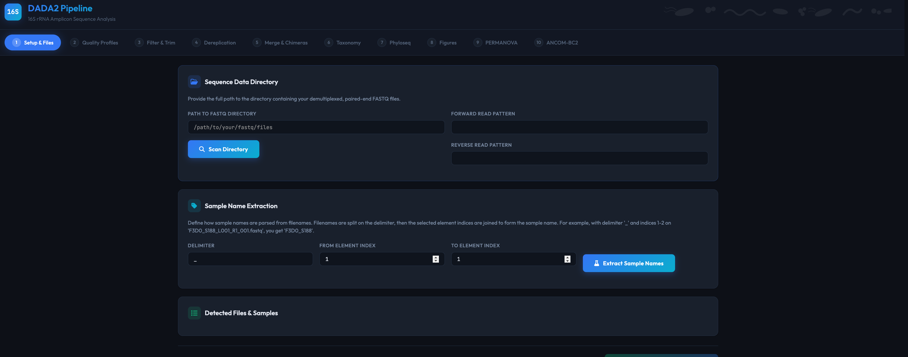

### Quality Profiles
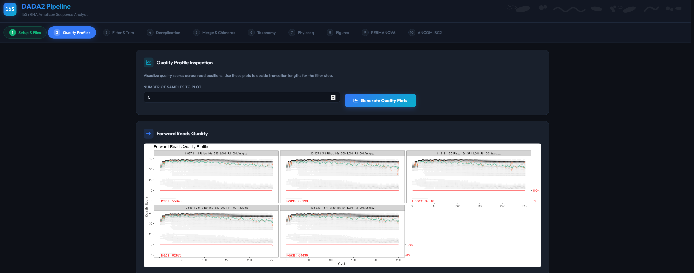

### Filter & Trim
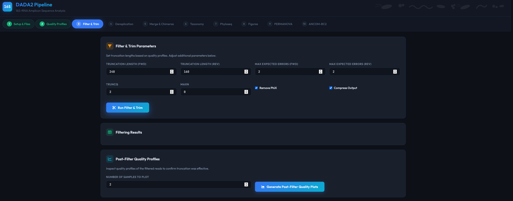

### DADA2 Error Learning & Dereplication
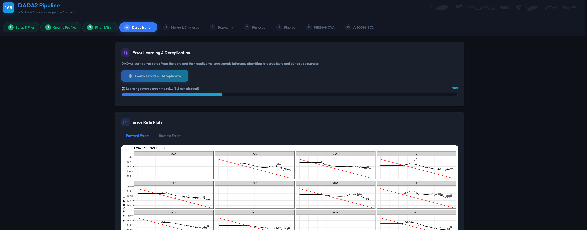

### Merge Reads & Remove Chimeras
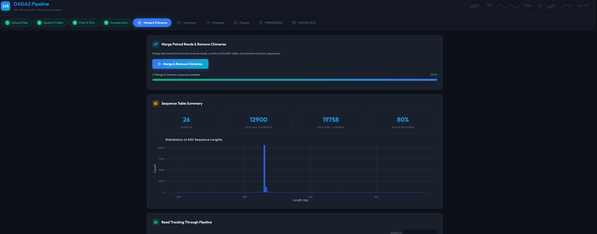

### Read tracking table
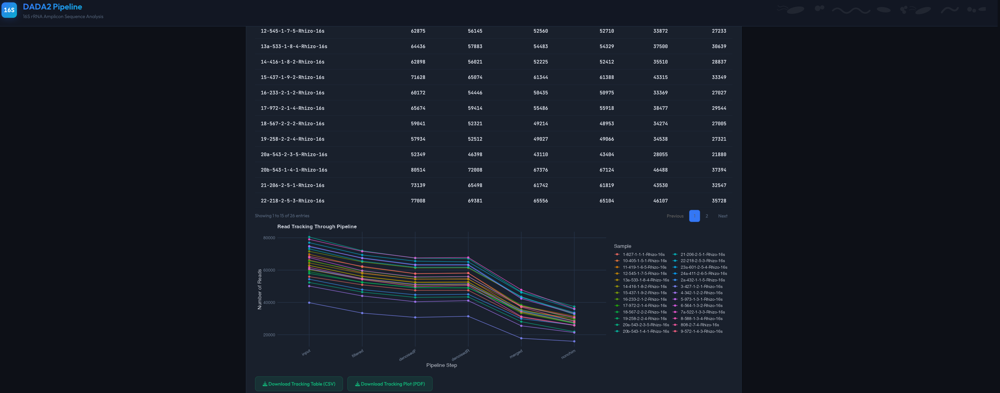

### Assign taxonomy
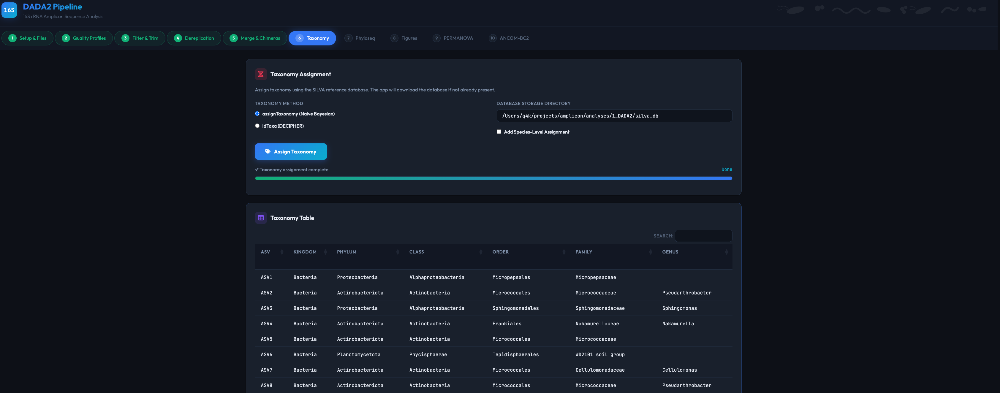

### Phyloseq & Data Transformation
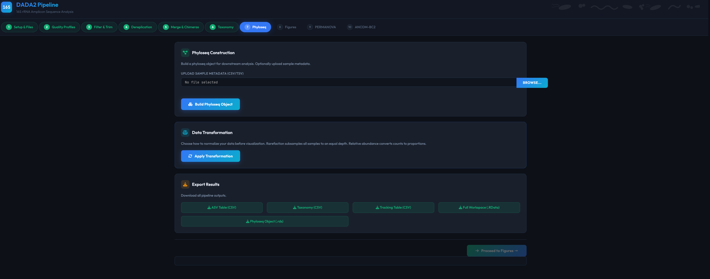

### Rarefaction curve
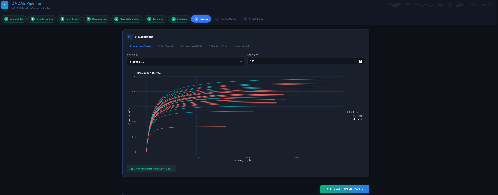

### Alpha Diversity
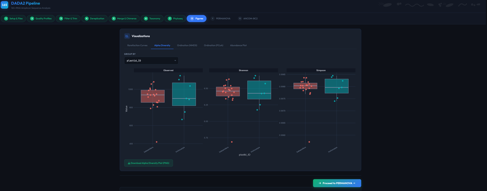

### Ordination (PCoA)
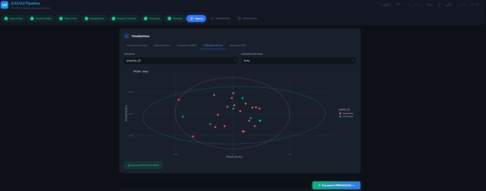

### PERMANOVA
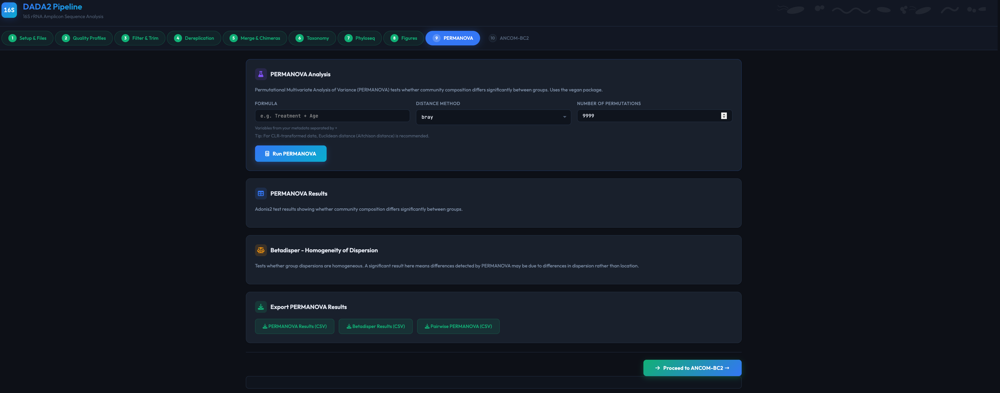

### ANCOM-BC2
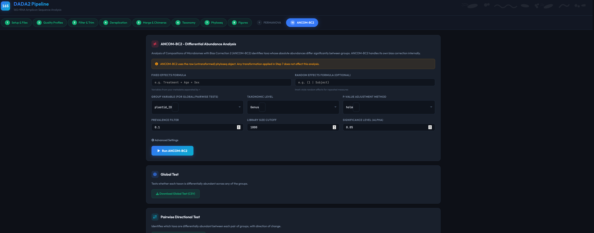

---

## Architecture

Both apps share a common architecture:

- **Asynchronous computation** via `callr::r_bg()` background subprocesses — resolves the incompatibility between DADA2's fork-based multiprocessing and Shiny's reactive framework
- **JavaScript-driven instant progress indicators** — animated progress bars appear immediately on button click, before Shiny's reactive flush
- **Reactive session persistence** — auto-saves `.RData` to the data directory after each step
- **Dynamic UI** — metadata variable types, primer inputs, and quality plot sample counts adapt to the data

---

## Troubleshooting

### Common Issues

**App won't start / package installation fails**
- Ensure R >= 4.0 is installed
- Try installing Bioconductor packages manually:
  ```r
  if (!requireNamespace("BiocManager", quietly = TRUE))
    install.packages("BiocManager")
  BiocManager::install(c("dada2", "phyloseq", "ANCOMBC", "microbiome", "DECIPHER"))
  ```

**Cutadapt not found (ITS app)**
- Install via pip: `pip install cutadapt` or `pip3 install cutadapt`
- Or provide the full path to cutadapt in the app

**Cutadapt produces no output files**
- Check primer sequences match your reads (verify via the primer hit count table)
- Paths with spaces are handled automatically via shell quoting

**Phyloseq construction fails / no sample names match**
- Ensure the first column of your metadata CSV contains sample names matching the extracted sample names shown in Step 1
- The app handles CSVs with quoted rows (common Excel export issue) automatically

**ANCOM-BC2 / PERMANOVA errors about missing variables**
- Both tools validate formula variables before running — check the error notification for the exact variable name and available metadata columns

**Taxonomy step hangs**
- 16S: SILVA database download may take time on first use
- ITS: Ensure the UNITE database path points to an actual `.fasta` file or a directory containing one

---

## Citation

If you use shinyDADA2 in your research, please cite:

> [Authors]. shinyDADA2: R/Shiny applications for interactive amplicon sequence analysis of 16S rRNA and ITS markers. [Journal], [Year]. DOI: [DOI]

Please also cite the underlying tools:

- **DADA2:** Callahan BJ et al. (2016) DADA2: High-resolution sample inference from Illumina amplicon data. *Nature Methods* 13:581-583
- **phyloseq:** McMurdie PJ & Holmes S (2013) phyloseq: An R package for reproducible interactive analysis and graphics of microbiome census data. *PLoS ONE* 8:e61217
- **ANCOM-BC2:** Lin H & Peddada SD (2024) Multigroup analysis of compositions of microbiomes with covariate adjustments and repeated measures. *Nature Methods* 21:83-91
- **vegan:** Oksanen J et al. (2022) vegan: Community Ecology Package. R package
- **cutadapt:** Martin M (2011) Cutadapt removes adapter sequences from high-throughput sequencing reads. *EMBnet.journal* 17:10-12

---

## Contributing

Contributions are welcome! Please open an issue or submit a pull request.

1. Fork the repository
2. Create a feature branch (`git checkout -b feature/my-feature`)
3. Commit your changes (`git commit -am 'Add my feature'`)
4. Push to the branch (`git push origin feature/my-feature`)
5. Open a Pull Request

---

## License

This project is licensed under the MIT License — see the [LICENSE](LICENSE) file for details.

---

## Acknowledgments

shinyDADA2 builds on the outstanding work of the R/Bioconductor microbiome analysis ecosystem, including DADA2, phyloseq, vegan, ANCOM-BC2, microbiome, DECIPHER, and the Shiny framework.
